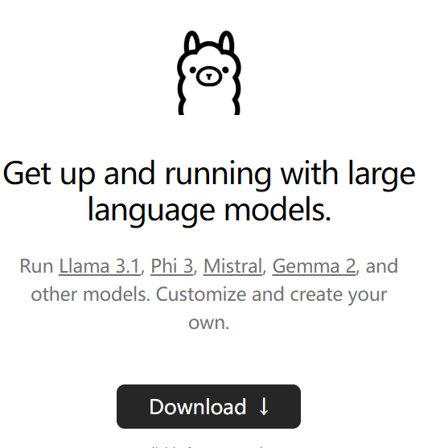

---
title = '(Begineer) 5 mins for Llama deployment(No GPU)'
date = 2024-09-04T11:43:23+02:00
# weight: 1
# aliases: ["/first"]
tags: ["first"]
author: "Me"
# author: ["Me", "You"] # multiple authors
showToc: true
TocOpen: false
draft: false
hidemeta: false
comments: false
description: "Desc Text."
canonicalURL: "https://canonical.url/to/page"
disableHLJS: true # to disable highlightjs
disableShare: false
disableHLJS: false
hideSummary: false
searchHidden: true
ShowReadingTime: true
ShowBreadCrumbs: true
ShowPostNavLinks: true
ShowWordCount: true
ShowRssButtonInSectionTermList: true
UseHugoToc: true
cover:
    image: "https://github.com/SmartZhuo/Project-Thesis_FAU/blob/main/image/mymarker1.png?raw=true" # image path/url
    alt: "<alt text>" # alt text
    caption: "<text>" # display caption under cover
    relative: false # when using page bundles set this to true
    hidden: false # only hide on current single page
editPost:
    URL: "https://github.com/<path_to_repo>/content"
    Text: "Suggest Changes" # edit text
    appendFilePath: true # to append file path to Edit link
---

You can build your own LLM with simple setup. Without prioer knowledge, you can build your local LLM.
Here is procedure in Windows

## 1 Install Ollama
1.1 download and install Ollama 3.1  https://ollama.com/

1.2    Choose the model

1.3    There are 8b, 70b, 405b options. for self use, 8b is enough.

1.4   copy the comand to powersell to install the model
   

## 2 Insall openweb UI
2.1 install Docker https://www.docker.com/  
        (If can not install, try to install previous version)

2.2 go to openweb UI github to install session.
    we have already installed docker and Ollima, simple to run following command in Shell
    docker run -d -p 3000:8080 --add-host=host.docker.internal:host-gateway -v open-webui:/app/backend/data --name open-webui --restart always ghcr.io/open-webui/open-webui:main

# 3. Open http://localhost:3000/
3.1 choose the model of install 7b version. and you can communicate with AI locally. My laptop has low performance, therefore it is quite slow. 

# 4. 70b version
Instead of local 7b version. we can install 70b version through Groq cloud.
4.1 Go to Groq cloud webiste https://console.groq.com/playground

4.2 choose API Key on left side 

4.3 create API key and copy it(it only appears once, please store it)

4.4 Go back to http://localhost:3000/

4.5 Click your account(down left) --> Admin panel --> setting --> connecion :
    openAI API: https://api.groq.com/openai/v1
    API Key: you get from 4.3

4.6 back to homepage, you have 70b and more version 